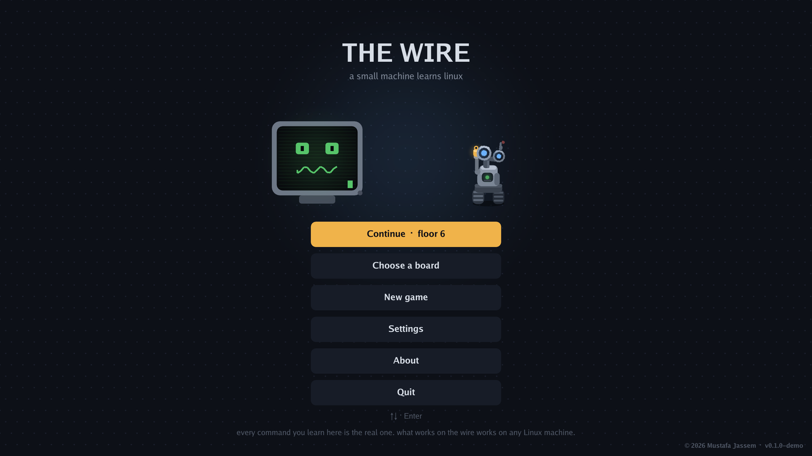
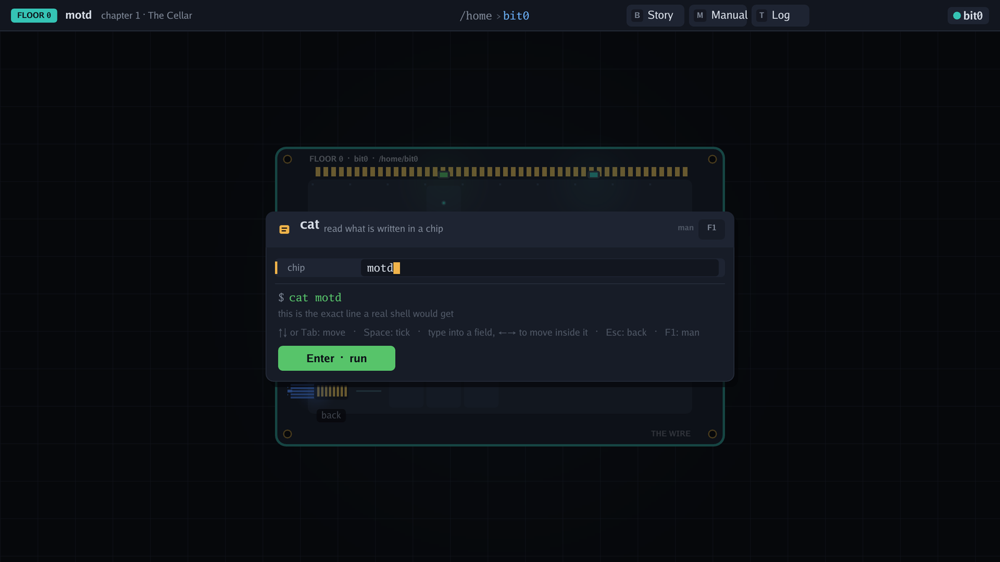
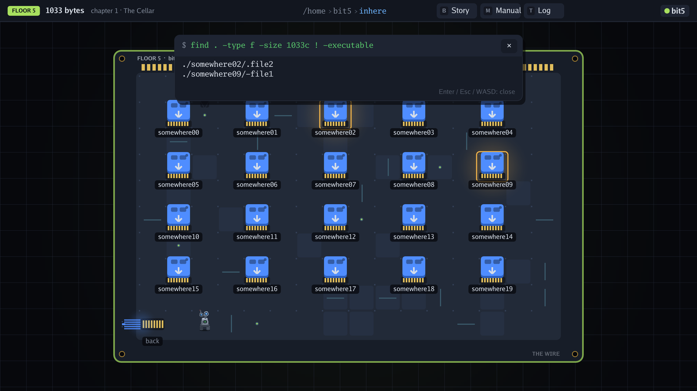

<div align="center">

# The Wire

**A small machine learns Linux. A free game that teaches the command line by playing it.**

[](../../releases)
[](../../releases)
[](../../releases)
[](../../releases)

© 2026–present · Mustafa Jassem ([@m51v5](https://github.com/m51v5)) · [thewire.m51v5.com](https://thewire.m51v5.com)

</div>

---

You are **Ohm**, a maintenance robot that woke up inside an old server with its memory wiped. The Archive, the machine's manual daemon, teaches you one command per board. Every command you run is real, against a simulated filesystem: `ls`, `cd`, `cat`, `file`, `find`, `grep` and the rest, with their real flags. What works on the wire works on any Linux machine.

```
walk the board ──► pick a command ──► tick its options ──► read the exact shell line ──► run it
```







**Why The Wire:**
- Real commands, real output, real flags — nothing is simplified for the game
- Build, don't guess: a builder shows the exact line a shell would get; typing unlocks on floor 3
- The Archive: a manual page for every command, one key away. Hints cost nothing but pride
- Yours, offline: nothing collected or sent, one executable, no installer

---

## Download

This is a **demo**: chapter 1, floors 0–6 ("The Cellar"). Versions carry the `-demo` suffix until the full game ships.

Grab the latest zip from the [Releases](../../releases/latest) page.

| File | Contents |
|------|----------|
| `thewire-<version>-windows-amd64.zip` | `thewire.exe` + the content packs beside it |

Unzip anywhere and run `thewire.exe`.

- Windows 10 or 11, 64-bit
- No installer, no admin rights, no background service
- Keyboard and mouse
- English and Arabic

---

## Playing

| Key | Action |
|-----|--------|
| `WASD` | walk |
| `E` / click | choose a command |
| `Enter` | run |
| `Esc` | back, pause |
| `H` | hint |
| `B` | briefing |
| `M` | manual |
| `T` | log |
| `Tab` | type (floor 3+) |
| `F3` | stats |

Each board hides the password to the next one. Read the right chip, take the key, plug into the uplink with `ssh`, and climb.

---

## Updates

The game asks GitHub once at launch whether a newer release exists and shows a tag on the title screen when one does. It sends nothing about you; switch it off in **Settings → Check for updates at launch**. **Settings → Check for updates** asks on demand. That is the only network request the game makes.

---

## Notes

- Saves and settings live in `%AppData%\thewire\` (`save.json`, `settings.json`). Delete that folder to remove every trace.
- Puzzle structure follows the Bandit wargame by [OverTheWire](https://overthewire.org), which is free to play. No OverTheWire passwords are used or shown; every password in the game is generated locally.
- Third party: Ebitengine (Apache 2.0) · Go fonts, x/image, x/text (BSD 3-Clause) · Vazirmatn (OFL 1.1).

---

## License

See [LICENSE](LICENSE). The Wire is free: play it, share it, pass it on. The game, its code, story and characters belong to the author; the art and sound are free to use. Source code is closed; this repo holds the docs and the release builds.
